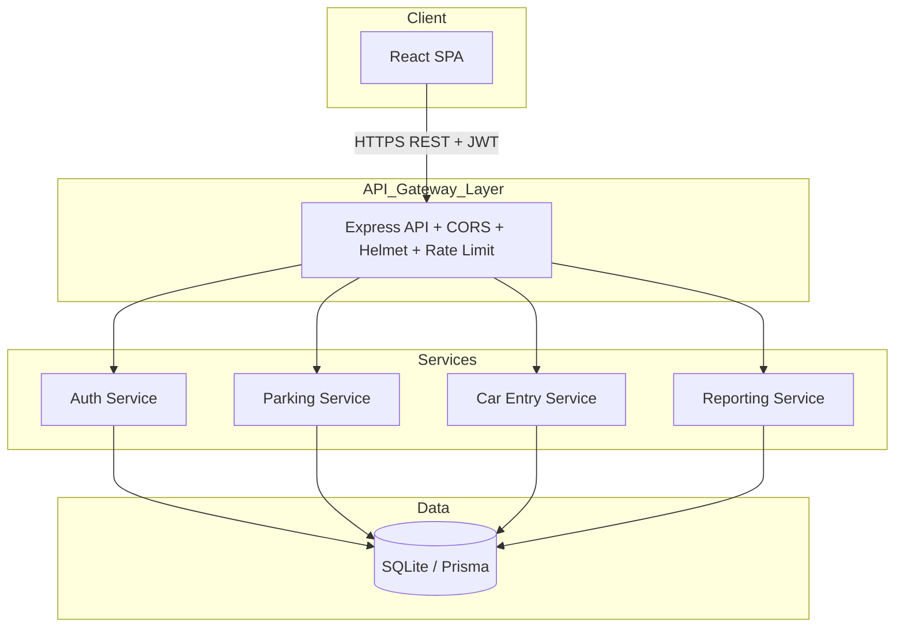

# System Architecture — XWZ Parking Management

## High-Level Architecture



## Microservices Mapping (Logical Boundaries)

| Service | Responsibility | API Prefix |
|---------|----------------|------------|
| Auth | Signup, login, JWT, roles | `/api/auth` |
| Parking | CRUD parkings, list availability | `/api/parkings` |
| Car Entry | Entry, exit, ticket, bill | `/api/entries` |
| Reports | Date-range reports | `/api/reports` |

Current implementation uses a **modular monolith** (single Node process, separated routes/controllers) suitable for coursework and easy deployment; each module can be extracted to its own service later.

## Security

- **JWT** in `Authorization: Bearer <token>`
- **bcrypt** password hashing (cost 12)
- **Helmet** HTTP headers
- **express-rate-limit** on auth routes
- **CORS** whitelist (frontend origin)
- **Role middleware**: `requireAdmin`, `requireAttendantOrAdmin`
- **Validation**: express-validator on all inputs

## Technology Stack

| Layer | Choice |
|-------|--------|
| Frontend | React 18 + Vite + React Router |
| Backend | Node.js 20 + Express |
| ORM | Prisma |
| Database | SQLite (file `dev.db`) |
| API Docs | Swagger UI (`/api-docs`) |
| Logging | Winston |

## Deployment View (Development)

```
Frontend :5173  →  proxy  →  Backend :3001
Backend :3001  →  Prisma  →  SQLite file
```
