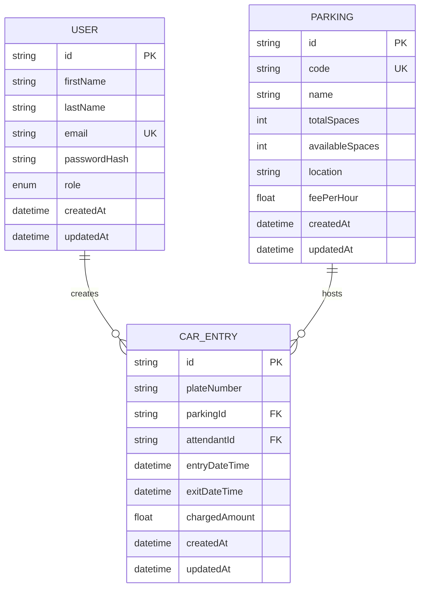

# Database Design — XWZ Parking System

## ER Diagram (Conceptual)

## Tables

### `User`

| Column | Type | Constraints |
|--------|------|-------------|
| id | UUID | PK |
| firstName | VARCHAR(100) | NOT NULL |
| lastName | VARCHAR(100) | NOT NULL |
| email | VARCHAR(255) | UNIQUE, NOT NULL |
| password | VARCHAR(255) | NOT NULL (bcrypt hash) |
| role | ENUM | `ADMIN`, `PARKING_ATTENDANT` |
| createdAt | TIMESTAMP | DEFAULT now |
| updatedAt | TIMESTAMP | |

### `Parking`

| Column | Type | Constraints |
|--------|------|-------------|
| id | UUID | PK |
| code | VARCHAR(50) | UNIQUE, NOT NULL |
| name | VARCHAR(200) | NOT NULL |
| totalSpaces | INT | NOT NULL, > 0 |
| availableSpaces | INT | NOT NULL, >= 0 |
| location | VARCHAR(500) | NOT NULL |
| feePerHour | DECIMAL(10,2) | NOT NULL, >= 0 |
| createdAt | TIMESTAMP | |
| updatedAt | TIMESTAMP | |

### `CarEntry`

| Column | Type | Constraints |
|--------|------|-------------|
| id | UUID | PK |
| plateNumber | VARCHAR(20) | NOT NULL |
| parkingId | UUID | FK → Parking |
| attendantId | UUID | FK → User (nullable for system) |
| entryDateTime | TIMESTAMP | NOT NULL |
| exitDateTime | TIMESTAMP | NULL on entry |
| chargedAmount | DECIMAL(10,2) | DEFAULT 0 |
| createdAt | TIMESTAMP | |
| updatedAt | TIMESTAMP | |

**Business rules**

- On insert: `exitDateTime = null`, `chargedAmount = 0`, `availableSpaces -= 1`
- On exit: set `exitDateTime`, compute `chargedAmount`, `availableSpaces += 1`
- Active entry: same `plateNumber` + `parkingId` where `exitDateTime IS NULL`
